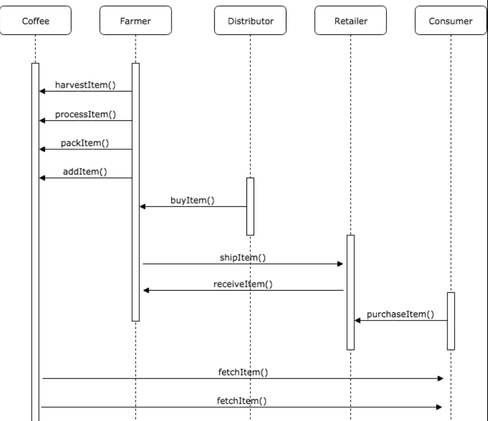

# Project 6B Supply Chain

## Truffle Version
>
    Truffle v4.1.14 (core: 4.1.14)
    Solidity v0.4.24 (solc-js) >

## Node Version
>
    node v16.13.0
>

## web3 Version
>
    "web3": "^1.6.1"
>
## Contract Address
>
    0x110c154d0b28f4689a6453051ccd3bbd2f412f1c 
>

## Requirement 1: Project write-up - UML

### Activity Diagram


## Requirement 2: Project write-up - Libraries
There were issues while creating frontend, after some research found that have to include following script in html file
>
    <script src="https://cdn.jsdelivr.net/npm/web3@latest/dist/web3.min.js"></script>
    <script src="https://cdn.jsdelivr.net/npm/@truffle/contract@4.3.5/dist/truffle-contract.js"></script>
>

## Requirement 3: Project write-up - IPFS
Not used IPFS.

## Getting Started
These instructions will get you a copy of the project up and running on your local machine for development and testing purposes. See deployment for notes on how to deploy the project on a live system.

### Prerequisites

Please make sure you've already installed ganache-cli, Truffle and enabled MetaMask extension in your browser.

### Installing

A step by step series of examples that tell you have to get a development env running

Clone this repository:

```
git clone https://github.com/udacity/nd1309/tree/master/course-5/project-6
```

Change directory to ```project-6``` folder and install all requisite npm packages (as listed in ```package.json```):

```
cd project-6
npm install
```

Launch Ganache:

ganache or ganache-clie and adjust ```truffle-config.js``` or ```truffle.js``` accordingly

In a separate terminal window, Compile smart contracts:

```
truffle compile
```

This will create the smart contract artifacts in folder ```build\contracts```.

Migrate smart contracts to the locally running blockchain:

```
truffle migrate
```

Test smart contracts:

```
truffle test
```

All 10 tests should pass.

In a separate terminal window, launch the DApp:

```
npm run dev
```
